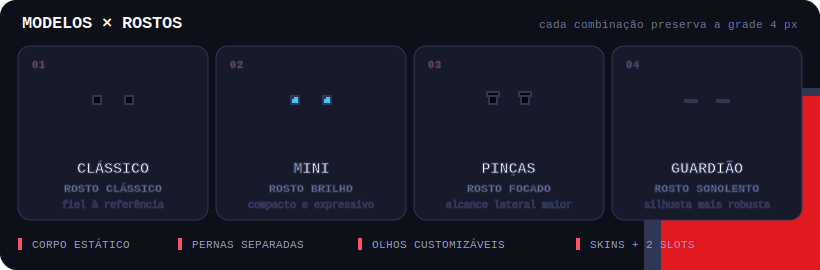

<div align="center">



<br/>

[](https://developer.chrome.com/docs/extensions/mv3/)
[](./manifest.json)
[](./LICENSE)
[](./src/)

**Claw'd** é uma extensão Chrome que injeta um mascote pixel-art interativo em qualquer página da web.  
Ele anda, desliza, reage, dorme, pisca, demonstra emoções e cuida de seus próprios sub-pets — com animações CSS e movimento sincronizado ao refresh rate do navegador.

[Instalar](#-instalação) · [Funcionalidades](#-funcionalidades) · [Personalização](#-personalização) · [Validação](#-validação) · [Contribuir](#-contribuição)

🌐 **Explore:** [Índice de docs](./docs/README.md) · [Arquitetura](./docs/ARCHITECTURE.md) · [Documentação Interativa](./docs/index.html) · [Documentação Técnica](./docs/md/DOCUMENTACAO.md) · [Manual](./docs/md/MANUAL.md) · [Validação](./docs/md/VALIDACAO.md) · [Melhorias](./docs/md/MELHORIAS.md) · [CHANGELOG](./CHANGELOG.md)

</div>

---

## 📖 O artigo: um bichinho de estimação para a web moderna

> *Toda aba aberta é um lugar solitário. O Claw'd existe para que não seja.*

Passamos horas dentro do navegador — lendo, trabalhando, procrastinando — e a página nunca olha de volta. O **Claw'd** nasceu de uma ideia simples e teimosa: e se um cantinho da tela tivesse vida própria? Não um assistente que fala demais, nem um popup que interrompe, mas um **companheiro pixel-art** que anda pela borda da janela, cochila quando você some, comemora quando você volta e, de vez em quando, faz uma embaixadinha só para se exibir.

### Pixel a pixel, de propósito

O visual é deliberadamente **pixel-art numa grade de 4 px**. Cada modelo — Clássico, Mini, Pinças e Guardião — é uma silhueta desenhada célula a célula, com **corpo estático**, **pernas em camada própria** (ciclo só no deslocamento) e **`.pixel-fx`** para poses de ação (aceno, pulo, dança, etc.) em frames `steps(1)`. Os olhos têm cor independente, piscam sozinhos e ganham **nove rostos** (Clássico, Brilho, Focado, Sonolento, Piscadela, Fofinho, Bravo, Apaixonado e Babão). O pet principal e os acessórios são **CSS puro** (`box-shadow`); os **sub-pets** usam PNGs literais em [`src/shared/sprites/subpets/`](./src/shared/sprites/subpets/) (com fallback `box-shadow` se você personalizar a paleta) — o sheet canônico está em [`tests/sprite-out/Subpets-selection.png`](./tests/sprite-out/Subpets-selection.png). Tudo sincronizado ao *refresh rate* real via `requestAnimationFrame`.

### O gramado dentro do navegador ⚽

A alma brincalhona do Claw'd está na profissão **Jogador**. Aqui a bola não é enfeite — é jogável, no **pé direito** do pet (longe do subpet). **Toque na bola** e ele começa uma sequência de **embaixadinhas**: cada toque sobe a bola num arco pixel-art, o som ganha um tom mais agudo e um **contador ao vivo** flutua ao lado direito. Demore demais e a bola cai, **rola para a direita** e o pet corre atrás — a janela de tempo *encolhe* conforme o combo cresce, transformando um detalhe fofo num pequeno **minijogo de ritmo e habilidade**. Quando quiser fechar com chave de ouro, **dê um duplo-clique**: o Claw'd finaliza a jogada com um **golaço** à direita, e quanto maior a sequência de embaixadinhas, maior o bônus de XP. Recordes viram conquistas (Malabarista, Rei do Combo), e quando você o deixa ocioso ele continua treinando sozinho.

### Um elenco em harmonia

Ao redor do futebol há um sistema inteiro que conversa entre si: **12 profissões** (Jogador, Tutor, Dev, Músico, Chef, Ninja, Pescador, Livre, Doutor, Artista, Gamer e Streamer), cada uma com uniforme temporário que *não* apaga acessórios pessoais; **31 acessórios** em três slots (cabeça, rosto, corpo); **sub-pets** com espécie, apelido e habilidades; **status estilo Tamagotchi** que geram emoções; e uma camada de **gamificação 2.0** com XP progressivo, sistema de combo, **12 desafios semanais**, **34 conquistas**, **14 quests diárias** (inclui balões e embaixadinhas) e PixelCoins. Tudo compartilha o mesmo **catálogo único** (`src/shared/catalog.js`), então o popup e o pet real sempre mostram exatamente os mesmos dados.

### Feito para durar (e para hackear)

Não há *build step* nem dependências externas: você clona, carrega a pasta no `chrome://extensions` e pronto. Por baixo, um **service worker** MV3 cuida da presença cross-tab e da reinjeção segura; o content script se auto-recupera de recargas; mensagens, storage e DOM passam por **sanitização e allowlists**; áudio só inicia após gesto do usuário; saves usam **coalesce**; e **159 testes automatizados** (mais um *smoke test* em Chromium real) guardam catálogos, schema, segurança, renderização, embaixadinhas e a integridade cruzada de todos os subsistemas. É um brinquedo — mas construído como software de verdade.

### Novidades em v3.7

A versão 3.7 levou as animações ao próximo nível: **hover state no modo pixel-art** (sombra e brilho ao passar o mouse sobre o pet), **ring de clique expansivo** ao pressionar o pet, **speed lines** ao correr e **rastro de pó** ao caminhar via `_spawnWalkDust()`. **Partículas contextuais** — corações ao ficar alegre, estrelas ao ficar extasiado, gotas ao ficar triste; faíscas de acessório só em **movimento, equip ou ação** (sem loops ambiente contínuos). No popup: **ripple nos botões de ação**, **flash dourado na barra de XP** ao subir de nível. Skins `glow` e `robot` ganham animações (brilho pulsante / scan-line pixel-art); rostos `sparkle` e `heart` têm keyframes próprios. A bola do **Jogador** ficou no **pé direito**, com visual pixel sem blur e chute/rolagem para a direita. Rosto **Babão**, partículas pixel ricas e skins animadas. Em **v3.7.2**: fones/facewear nítidos, FX de movimento, animações crisp e interações pet↔subpet fluidas. Em **v3.7.3**: harmonia de timing (tokens `--clawd-ease-*`), reduced-motion também na boca, hover que intensifica o glow, profissões **Gamer**/**Streamer** com cena-assinatura própria, subpets com pool autônomo ponderado pela personalidade + dança em duo, **`petVisible` persistente**, **Seguir nesta guia**, **modo minimalista** e correção de spawn no canto (rejeita saves `{0,0}`). **159/159** contratos.

### Novidades em v3.6

A versão 3.6 trouxe **polish completo de animações e interações**: props de profissão agora animam — o chef mexe a frigideira, o dev pisca um cursor verde, o jogador exibe a chuteira com tap-bounce. O **hover glow** no modo Smooth reflete a cor primária do pet via `--clawd-glow`. O SubPet ganhou **guard de ownership** no RAF (sem loops órfãos) e **frequência de interação adaptativa** baseada em personalidade (`playful`/`lazy`). Os **4 medidores de status** no popup são clicáveis (carinho / alimentar / brincar / banho). Personalização móvel via **Studio in-page** arrastável e janela destacável (`?detached=1`). Laptop só aparece no **Dev digitando**; acessórios de corpo ficam no peito/pescoço. Validação ponta a ponta: **150/150** contratos + ecosystem 100% das ações no motor.

### Novidades em v3.3

A versão 3.3 trouxe **Gamificação 2.0**: sistema de combo com janela de 10s (×3 balão, ×5 bônus XP), desafio semanal rotativo (4 desafios por hash de semana ISO, reset via `chrome.alarms`), 13 novas conquistas, 5 novas quests diárias e marcos de nível com recompensas automáticas (party_hat em nível 5, wings em 15). O pet também ganhou um **terceiro slot de acessório** (corpo: ribbon, wings, cape, armor), **4 novas profissões** (Doutor, Artista, Gamer, Streamer) com detecção de contexto em 11 categorias de sites, **4 novas ações** (flip, meditate, electric, nap), **8 novos keyframes CSS** e **3 novos temas de name-tag** (rainbow, holographic, minimal). A personalização avança com traços de personalidade (5 dimensões em sliders), cor de partícula, voz customizada e volumes por categoria.

O Claw'd não quer sua atenção o tempo todo. Ele só quer estar lá, no rodapé da sua tarde, pronto para uma embaixadinha quando você precisar sorrir.

---

## 🎬 Demonstração executável

Abra a [Documentação Interativa](./docs/index.html#demonstracao) para percorrer uma sessão guiada de **45 segundos e 18 etapas**: entrada, perspectiva 3D, carinho, ações, scroll, passeio, arraste com inércia, sono, despertar, pesca, futebol, desafio do Tutor, acessórios, modo liso e subpet especial.

A demonstração é HTML/CSS/JavaScript local — não um vídeo simulado — e inclui reprodução/pausa, navegação por capítulo, teclado, movimento reduzido e um storyboard quadro a quadro. A galeria reutiliza as próprias camadas pixel-art de `src/content/style.css` para o pet principal; os **sub-pets** carregam os mesmos PNGs do pacote (`../src/shared/sprites/subpets/<id>.png`). Os selos do topo refletem a validação atual: **159/159 contratos**, **8/8 scripts**, **4 modelos**, **9 rostos**, **12 profissões**, **31 acessórios (3 slots)**, **30 ações** (+ kick/keepy/superdance fora do popup), **7 ações do subpet**, **34 conquistas**, smoke expandido (skins/duo/partículas/multi-clique/subpets/props), **3/3 reloads limpos** e **0 erros de runtime**.

---

## 🐾 Modelos e Expressões do Mascote

<div align="center">

</div>

O Claw'd combina **estados de movimento, ações e emoções** que mudam conforme você interage com a página:

| Estado | Trigger | Animação |
|--------|---------|----------|
| 🐾 **Idle** | Padrão | Respiração, piscada e pernas imóveis |
| 🚶 **Walking / Running** | Passeio, arraste ou corrida | Pernas alternadas somente enquanto há deslocamento |
| ❤️ **Happy / Joyful** | Carinho e necessidades altas | Pulo, sorriso, balão de emoji e partículas |
| 💤 **Sleeping / Yawning** | Inatividade | Olhos fechados, bocejo e Zzz flutuante |
| ⚡ **Excited** | Scroll e descoberta de página | Tremida curta e expressão surpresa |
| 👋 **Waving** | Ação manual ou espontânea | Aceno com balão contextual |
| 🎣 **Fishing / Reeling** | Profissão Pescador | Vara, lago, fisgada e captura animada |
| 😢 **Sad / Hungry** | Status baixos | Boca e balão de emoção correspondentes |

---

## ✨ Funcionalidades

<table>
<tr>
<td width="50%">

### 🎨 Animações Fluidas
- Sprite padrão fiel ao modelo compacto vermelho de referência
- **4 modelos pixel-art**: Clássico, Mini, Pinças e Guardião, todos na grade de 4 px
- **Pernas em camada própria**: estáticas em repouso e em ciclo somente durante movimento
- **9 rostos e olhos com cor independente**: Clássico, Brilho, Focado, Sonolento, Piscadela, Fofinho, Bravo, Apaixonado e Babão
- Piscada independente, expressões faciais e **balão de emojis**
- Efeito **3D perspective** ao seguir o cursor
- **Partículas** de ❤️ ✨ ⭐ ao receber carinho
- **Pop-in** animado ao carregar a página
- **Sombra no chão** sincronizada com o movimento
- **Modo liso real** — mantém a silhueta angular do modelo, mas troca as células por blocos contínuos, sem grade, textura ou efeito de slime
- **Contorno** — borda escura ao redor do pet
- **Boca opcional** — remove apenas a boca, preservando olhos, piscadas e balões de emoji

</td>
<td width="50%">

### 🧠 Comportamento Inteligente
- **Andar automático** pela tela (configurável)
- **Balões de fala e emoção** com mensagens e emojis contextuais
- **Dorme** após 30s de inatividade
- **Acorda** ao clicar, scrollar ou arrastar
- Reação instantânea ao **scroll** da página
- Arraste com **inércia, deslizamento e colisão suave nas bordas**
- Um único pet principal após reload, com limpeza de instâncias órfãs
- Suporte completo a **touch** (mobile)

</td>
</tr>
<tr>
<td width="50%">

### 💼 Profissões & Roupas
- **12 profissões**: Livre, Jogador, Tutor, Dev, Músico, Chef, Ninja, Pescador, Doutor, Artista, Gamer e Streamer
- Pescador monta um **lago interativo**, lança a vara, fisga e captura peixes
- Jogador faz embaixadinhas; Tutor cria desafios; Dev digita; Músico toca riffs
- **31 acessórios** em três slots (cabeça, rosto, corpo) nos dois renderizadores; chapéus com detalhes, profundidade, área externa sem recorte e movimento sincronizado ao passo
- **Provador e cards ao vivo no popup** usam a arte CSS real do pet — inclusive modelos, skins, chapéus e óculos — e mostram os dois slots combinados
- Trajes de profissão são temporários: entram automaticamente sem apagar o boné, chapéu ou acessório pessoal salvo

</td>
<td width="50%">

### 🎮 Gamificação
- **Sistema de XP e níveis** — carinho dá +5 XP, gol dá +10 XP
- **PixelCoins, loja, conquistas, streak e missão diária**
- **Barra de progresso** animada no popup
- **Embaixadinhas interativas** — toque na bola para mantê-la no ar (contador ao vivo, combos e recorde); **duplo-clique finaliza com um golaço** ⚽🥅 e quanto maior a sequência, maior o bônus de XP
- **8 sub-pets** com apelido, cores independentes de corpo/olhos, sono, despertar, 7 ações manuais e habilidade por espécie
- Dragão e pássaro com **voo**; slime com clone; efeitos de partículas com teto e pausa em aba oculta
- **Balão** e **abraço** entre as ações principais do pet
- **Missão diária** resgatável, streak e conquistas
- Cross-tab com desconexão segura em **bfcache** (sem pilha de `runtime.lastError`)
- Sons 8-bit **apenas após gesto** do usuário (política de autoplay)
- Progresso salvo entre sessões

</td>
</tr>
</table>

---

## 🚀 Instalação

### Chrome / Edge / Brave

```bash
# 1. Clone o repositório
git clone https://github.com/hfkyxg/pet-ext-ap.git
cd pet-ext-ap

# 2. Abra o Chrome e vá para:
#    chrome://extensions/
#    (ou edge://extensions/ no Edge)

# 3. Ative "Modo do desenvolvedor" (canto superior direito)

# 4. Clique em "Carregar sem compactação"

# 5. Selecione a pasta pet-ext-ap/
```

Pronto! O Claw'd aparecerá no canto inferior direito de qualquer site. 🎉

---

## 🎨 Personalização

Clique no ícone da extensão para abrir o **menu de personalização**:

<div align="center">

```
┌─────────────────────────────────┐
│  [🐾]  Claw'd v3.7  🪙 120       │
├──────────┬────────────┬──────────┤
│ 🎨 💼 🧠 ⚡ 🐕 🛍️ 🏆 ⚙️       │
├──────────┴────────────┴──────────┤
│                                  │
│  Nome do pet: [_____________]    │
│                                  │
│  Modelo:  [01] [02] [03] [04]   │
│  Rosto:   [•]  [✦]  [⌁]  [–]    │
│                                  │
│  Cor:  ● ● ● ● ● ● ● ●          │
│  Olhos: [#08080b  ▼]             │
│                                  │
│  Tamanho:   ──●───  1.5×         │
│  Velocidade: ──●───  1.0×        │
│                                  │
└──────────────────────────────────┘
```

</div>

### Aba Aparência
- **Nome** — renomeia o pet (atualiza em tempo real)
- **Modelo** — alterna entre Clássico, Mini, Pinças e Guardião sem desalinhamento dos acessórios
- **Rosto** — escolhe entre os **9 rostos** do catálogo
- **Cor dos olhos** — picker independente da cor do corpo
- **Cor** — 8 cores predefinidas + picker customizado
- **Tamanho** — slider de 0.8× a 3.0×
- **Velocidade** — controla a velocidade da animação
- **Visual liso** — suaviza os pixels sem transformar ou redesenhar o pet
- **Contorno** — adiciona borda escura ao redor do mascote
- **Exibir boca** — mostra ou remove o sorriso e as expressões da boca sem alterar a sprite
- **Acessórios** — 14 opções em slots separados, cada uma com miniatura pixel-art real, descrição, dica e estado selecionado acessível

### Aba Profissão
- **⚽ Jogador** — bola de futebol jogável no **pé direito** do pet (pixel-art; toque = embaixadinhas, duplo-clique = gol)
- **📚 Tutor** — óculos automáticos + foco de estudo
- **💻 Dev** — fones automáticos + reações a sites de código
- **🎸 Músico** — riffs, dança e reações em sites de música
- **🧑‍🍳 Chef** — cozinha e torna a alimentação mais eficaz
- **🥷 Ninja** — truques de desaparecimento e surpresa
- **🎣 Pescador** — vara, lago, fisgada manual/automática e peixes raros
- **🩺 Doutor** — reações em sites de saúde; banho extra
- **🎨 Artista** — pinta no idle; estrelas ao posar
- **🎮 Gamer** — combo de ações com XP bônus em sites de jogos
- **📡 Streamer** — cena AO VIVO em sites de streaming
- **🐾 Livre** — modo padrão sem profissão

### Aba Comportamento
- **Balão de fala** — ativa/desativa mensagens
- **Andar automático** — pet passeia sozinho
- **Dormir** — ativa o modo de inatividade
- **Passeio entre abas** — mantém um único pet anfitrião e frequência configurável
- **Pegadas** — indica abas onde o pet não está

### Aba Ações
Dispare ações imediatas como **acenar, dançar, dar carinho, alimentar, brincar, posar, dar banho, dormir, acordar, pescar, pular, esticar e rugir**. A aba também permite **mostrar/ocultar** o pet (estado salvo), **seguir nesta guia** (cross-tab) e **resgatar** o pet ao canto preferido.

### Aba Sub-pets
Ative uma das oito espécies, atribua um **apelido**, personalize separadamente as cores do **corpo** e dos **olhos** e use o painel ao vivo para **dar carinho, brincar, explorar, rodopiar, comemorar ou executar a habilidade especial**. Uma interação acorda o subpet adormecido antes da animação.

---

## 🏗️ Estrutura do Projeto

```
pet-ext-ap/
├── manifest.json              # Configuração da extensão (MV3)
├── src/
│   ├── content/
│   │   ├── content.js         # Motor do mascote + sistema de estados
│   │   └── style.css          # Pixel-art CSS + keyframes de animação
│   ├── shared/
│   │   └── catalog.js         # Estado, catálogos, missões e migrações
│   ├── popup/
│   │   ├── popup.html         # Interface de personalização
│   │   ├── popup.css          # Dark UI design system
│   │   └── popup.js           # Controles e preview ao vivo
│   ├── background/
│   │   └── background.js      # Service worker (inicialização)
│   └── assets/
│       ├── pet-banner.svg     # Banner animado
│       └── pet-states.svg     # Showcase de modelos e rostos
├── tests/
│   ├── catalog.test.js        # Regras, sprites, emoções e ciclo de vida
│   ├── extension.test.js      # Manifest, popup, documentação e reload seguro
│   ├── integrity.test.js      # Harmonia entre catálogo e motor
│   ├── runtime-smoke.mjs      # Chromium real, interações e reloads
│   └── tools/                 # Geradores one-off (crop, make-sprites, shots…)
├── docs/
│   ├── README.md              # Índice da documentação
│   ├── ARCHITECTURE.md        # Camadas e padrões (SSOT, Facade, Strategy…)
│   ├── index.html             # Vitrine, player de mecânicas e laboratórios
│   ├── showcase.css           # Sistema visual, cenas e layout responsivo
│   ├── showcase.js            # Roteiro, evidências, catálogos e previews
│   └── md/                    # Markdown de produto
│       ├── DOCUMENTACAO.md    # Protocolo interno (detalhe)
│       ├── MANUAL.md          # Guia de uso
│       ├── VALIDACAO.md       # Evidências automatizadas e em Chromium real
│       ├── MELHORIAS.md       # Registro v3.2
│       └── Documentacao_Projeto_Clawd.md
├── LICENSE                    # Licença MIT (2026)
├── CHANGELOG.md
└── README.md
```


---

## 🔧 Como Funciona

### Sistema de Estados (content.js)

```javascript
// Estados alteram classes CSS e o balão de emoção correspondente
setState('happy')   // → node.classList.add('happy')
setState('sleeping') // → olhos fechados + filter escurecido
setState('excited')  // → animação de shake + walk acelerado
setState('waving')   // → braço levantado
setState('idle')     // → respiração/piscada, sem mexer as pernas
```

### Pixel-Art via CSS (style.css)

```css
/* Corpo e pernas são camadas independentes na mesma grade de 4×4px. */
#aic-clawd-node .pixel-sprite {
  box-shadow: var(--clawd-pixel-body);
  animation: none !important; /* a silhueta nunca troca de desenho */
}

#aic-clawd-node.walking .pixel-legs,
#aic-clawd-node.running .pixel-legs {
  animation: clawd-pixel-leg-cycle var(--clawd-step-duration) steps(1) infinite;
}

/* O modo liso remove as células e ativa a silhueta angular contínua. */
#aic-clawd-node.smooth :is(.pixel-sprite, .pixel-legs) { display: none; box-shadow: none; }
#aic-clawd-node.smooth .smooth-sprite { display: block; }
```

### Personalização em Tempo Real

```javascript
// Toda config usa CSS custom properties
node.style.setProperty('--agent-color', '#3498db'); // → cor muda instantaneamente
bodyNode.style.transform = `scale(${scale})`;        // → tamanho sem reflow
```

---

## 🎮 Interações

| Ação | Resultado |
|------|-----------|
| **Clicar** no pet | Pulo feliz + partículas + fala |
| **Arrastar e soltar** | Reposiciona, desliza com inércia e salva a posição |
| **Scrollar** | Estado excited por 1s |
| **Mover o mouse** | Perspectiva 3D (rotação suave) |
| **Clique duplo/triplo** | Ações especiais e sequências de emoção |
| **Clicar no sub-pet** | Carinho ou despertar com animação própria |
| **Painel do sub-pet** | Brincar, explorar, rodopiar, comemorar ou usar a habilidade da espécie |
| **Clicar no lago** | Fisga o peixe durante a profissão Pescador |
| **Touch (mobile)** | Arrastar e clicar funcionam |
| **Não interagir** por 30s | Pet adormece automaticamente |

---

## 💾 Persistência

Todas as configurações são salvas via `chrome.storage.local` e persistem entre sessões:

```javascript
chrome.storage.local.set({
  clawdState: {
    name:         "Claw'd",
    color:        "#c71515",
    eyeColor:     "#08080b",
    model:        "classic",
    faceStyle:    "classic",
    scale:        1.5,
    animSpeed:    1,
    showSpeech:   true,
    showMouth:    true,
    autoWalk:     true,
    sleepEnabled: true,
    position:     { x: 1200, y: 600 },
    smooth:       false,
    accessoryHead: 'none',
    accessoryFace: 'none',
    subpets:      { active: 'dog', unlocked: ['dog'], names: {}, colors: {}, eyeColors: {} },
    settings:     { crossTab: true, performanceMode: false }
  }
});
```

---

## 🗺️ Estado atual e próximos passos

O núcleo da **v3.7.3** está implementado e validado: quatro silhuetas, **nove rostos**, sete skins, olhos independentes, favoritos, sub-pets, 12 profissões, **31 acessórios em 3 slots**, pixel art em camadas, status clicáveis, studio móvel, cross-tab, loja, conquistas e missão diária. O registro histórico e ideias de expansão estão em [MELHORIAS.md](./docs/md/MELHORIAS.md):

| Área | Destaques |
|------|-----------|
| ⭐ **Favoritos** | Favorite ações, profissões, acessórios, cores e apelidos — favoritos ganham prioridade |
| 🐕 **Sub-Pets** | Oito espécies com apelido, corpo/olhos customizáveis, sprites pixel-art, sete ações ao vivo e habilidades próprias |
| 🎬 **Animações & Acessórios** | Corpo/pernas separados, 3 slots (31 itens), body no peito/pescoço; ações extras (balão, abraço, spin…) |
| 📌 **Studio & popup** | Studio in-page arrastável, janela destacável, 4 status clicáveis, 8 abas |
| 🔐 **Segurança & Runtime** | Allowlist de mensagens, sanitização de storage/DOM, cores hex-only, sites bloqueados por host exato, áudio pós-gesto, bfcache sem `lastError` |
| 🧬 **Modelos & Rostos** | 4 silhuetas × 9 rostos, 7 skins, cor de olhos independente e Clássico fiel à referência |
| 😊 **Status & Emoções** | Felicidade, fome, energia e higiene estilo Tamagotchi, com emoções derivadas |
| 💼 **Profissões 2.0** | Embaixadinhas com contador e recorde, desafios do Tutor, digitação do Dev + novas profissões |
| 🎮 **Gamificação** | Curva de XP progressiva, PixelCoins, lojinha, conquistas, streak e missão diária resgatável |
| 🖥️ **Renderização adaptativa** | Movimento em `requestAnimationFrame`, leitura do refresh rate e sprite pixel-perfect como padrão |
| 🌐 **Cross-Tab** | O pet passeia entre abas; reload limpa instâncias órfãs e recria somente o principal na aba ativa |
| 😄 **Emoções visuais** | Balão de emojis, piscadas e boca ligada por padrão (`showMouth: true`); desligável sem afetar olhos/balões |
| 🤝 **Duo & página** | Cenas pet↔subpet (abraço, brincadeira, soneca sync) e engajamento após dwell (olhar ao redor, peek na página) |
| ⚙️ **Configurações** | Skins, sons 8-bit, horário de silêncio, sites bloqueados, export/import de progresso |

---

## ✅ Validação

O projeto não usa build step nem dependências externas. A validação local inclui:

```powershell
node --check src/shared/catalog.js
node --check src/content/content.js
node --check src/popup/popup.js
node --check src/background/background.js
node --test tests/*.test.js
node tests/runtime-smoke.mjs
```

Os **159 testes automatizados** validam catálogos, schema v5, quatro modelos, **nove rostos**, sete skins, cor dos olhos, missões (incl. balões/keepy), sprite padrão, separação corpo/pernas, modo liso, boca opcional/emoções, chapéus sem recorte, composição dos slots, trajes profissionais não destrutivos, sub-pets, documentação interativa, pesca, manifest, popup (studio/status/summon/minimal), movimento adaptativo, isolamento de CSS, contexto MV3 invalidado, **bfcache/lastError**, **AudioContext pós-gesto**, **allowlist de mensagens**, **sites bloqueados sem substring**, **anti-poluição de protótipo**, **save coalesce / particle timers**, extras **kick/keepy/superdance**, **100% das ações no `_handleAction`**, ownership da bola no pé direito, babinha/escala do balão, combo/streak/claim, **`petVisible`/`clawdHasSavedPosition`** e reconciliação após reload. O contrato da documentação também exige 18 capítulos, 18 cartões de evidência, IDs únicos, catálogos reais e ausência de mídia externa ou vídeo fictício. O smoke test abre o Edge/Chromium com um perfil isolado e exercita em runtime real **4/4 modelos e 8/8 rostos**, os acessórios nos dois renderizadores, o provador pixel/liso do popup, a cor dos olhos, o controle persistente da boca, o movimento dos chapéus, 12 profissões e os estados esperados das ações do catálogo (**30** no popup). Também prova que o corpo não morpha e apenas as pernas caminham, restauração do visual pessoal, efeitos cosméticos ligados/desligados pelo modo desempenho, pesca cancelada sem recompensa, pesca concluída com incremento, clique físico de carinho, subpet com suas **7** interações e três reloads consecutivos com um único pet e zero erros. Passe um caminho de página como argumento para reproduzir um caso específico: `node tests/runtime-smoke.mjs "C:\caminho\pagina.html"`.

A vitrine também foi inspecionada em navegador real nos layouts desktop e móvel: player funcional, avanço automático, seleção direta das etapas lisa/subpet, acessórios no laboratório, **zero logs de erro** e nenhuma rolagem horizontal em 375 px.

O visual inicial continua exatamente o sprite compacto vermelho de referência: modelo Clássico, rosto Clássico, olhos `#08080b`, pixels nítidos, sem blur, escala 1.5×, skin normal e acessórios desligados. O navegador sincroniza deslocamentos ao refresh rate disponível; em monitores de 120/144/165 Hz o `requestAnimationFrame` acompanha essa cadência, enquanto o modo de baixo refresh reduz efeitos secundários.

Ao arrastar e soltar com velocidade, o Claw'd desliza sobre o conteúdo da página com inércia, rebate suavemente nas bordas e mantém o ciclo das pernas ativo apenas durante o movimento.

## 🤝 Contribuição

1. Fork o projeto
2. Crie uma branch: `git checkout -b feature/nova-skin`
3. Commit: `git commit -m 'add: nova skin do mascote'`
4. Push: `git push origin feature/nova-skin`
5. Abra um Pull Request

### Como validar localmente

```powershell
node --check src/shared/catalog.js
node --check src/content/content.js
node --check src/popup/popup.js
node --check src/background/background.js
node --check docs/showcase.js
node --test tests/*.test.js
node tests/runtime-smoke.mjs
```

Não há `package.json` de runtime nem build step: Node 18+ basta para a suíte. Scripts úteis: `npm test`, `npm run check`, `node tests/tools/validate-ecosystem.mjs`. O smoke abre o Edge/Chromium com a extensão descompactada (`EDGE_PATH` se o Edge não estiver no caminho padrão).

### Regenerar sprites de sub-pets

A arte canônica dos PNGs do pacote vem do sheet literal:

```powershell
node tests/tools/crop-literal-sprites.mjs
```

`node tests/tools/make-sprites.mjs` atualiza frames/preview em `tests/sprite-out/` e o catálogo, mas **não** sobrescreve `src/shared/sprites/subpets/*.png` a menos que você force `WRITE_PKG_SPRITES=1`. Depois rode `node --test tests/*.test.js` para confirmar que docs/métricas e assets continuam alinhados.

### Checklist de PR

- [ ] `node --test tests/*.test.js` verde (159 contratos)
- [ ] Docs/manual/showcase coerentes com contagens reais (30 ações + extras, 31 acessórios, 34 conquistas, 14 quests, 12 weekly, schema v5)
- [ ] Sem secrets (`.env`, credenciais) no diff
- [ ] Após editar content/CSS: recarregar a extensão **e** a aba de teste

### Ideias de contribuição
- [ ] Novas skins e acessórios pixel-art
- [ ] Mais desafios e peixes raros por profissão
- [x] Sete interações manuais e habilidades próprias para os sub-pets
- [ ] Testes E2E automatizados em Chrome real
- [ ] Suporte a Firefox (WebExtensions)

---

## 📄 Licença

MIT © 2026 — Feito com ❤️ e muitos pixels.

---

<div align="center">

**⭐ Se curtiu, deixa uma star no repositório!**

`🐾 Claw'd — Seu companheiro pixel-art na web 🌐`

</div>
